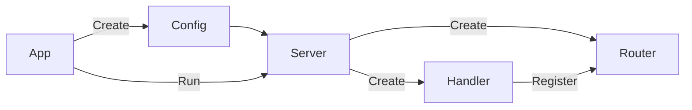
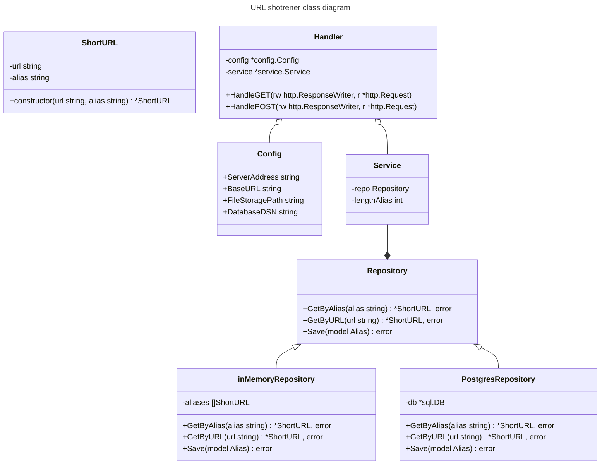

# URL Shortener

```mermaid
flowchart LR

App --> |Create| Config
Config --> Server
App --> |Run| Server
Server --> |Create| Handler
Server --> |Create| Router
Handler --> |Register| Router
```

```mermaid
---
title: URL shotrener class diagram
---
classDiagram

    class Config{
	+ServerAddress   string 
	+BaseURL         string 
	+FileStoragePath string 
	+DatabaseDSN     string 
    }

    class ShortURL{
        -url string
        -alias string

        +constructor(url string, alias string) *ShortURL
    }

    class Repository{
        +GetByAlias(alias string) *ShortURL, error
        +GetByURL(url string) *ShortURL, error
        +Save(model Alias) error
    }
    class inMemoryRepository{     
        -aliases []ShortURL

        +GetByAlias(alias string) *ShortURL, error
        +GetByURL(url string) *ShortURL, error
        +Save(model Alias) error
    }
    class PostgresRepository{     
        -db *sql.DB


        +GetByAlias(alias string) *ShortURL, error
        +GetByURL(url string) *ShortURL, error
        +Save(model Alias) error
    }
    class Service{
        -repo Repository
        -lengthAlias int
    }

    class Handler{
        -config *config.Config
        -service *service.Service

        +HandleGET(rw http.ResponseWriter, r *http.Request)
        +HandlePOST(rw http.ResponseWriter, r *http.Request)
    }

    Handler o-- Config
    Handler o-- Service
    Service --* Repository
    Repository <|-- inMemoryRepository
    Repository <|-- PostgresRepository


```
