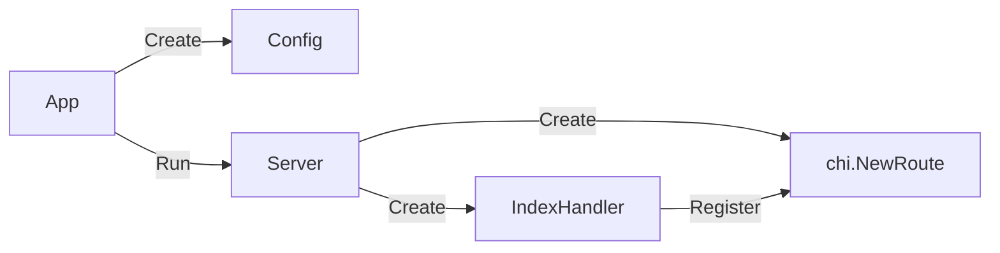
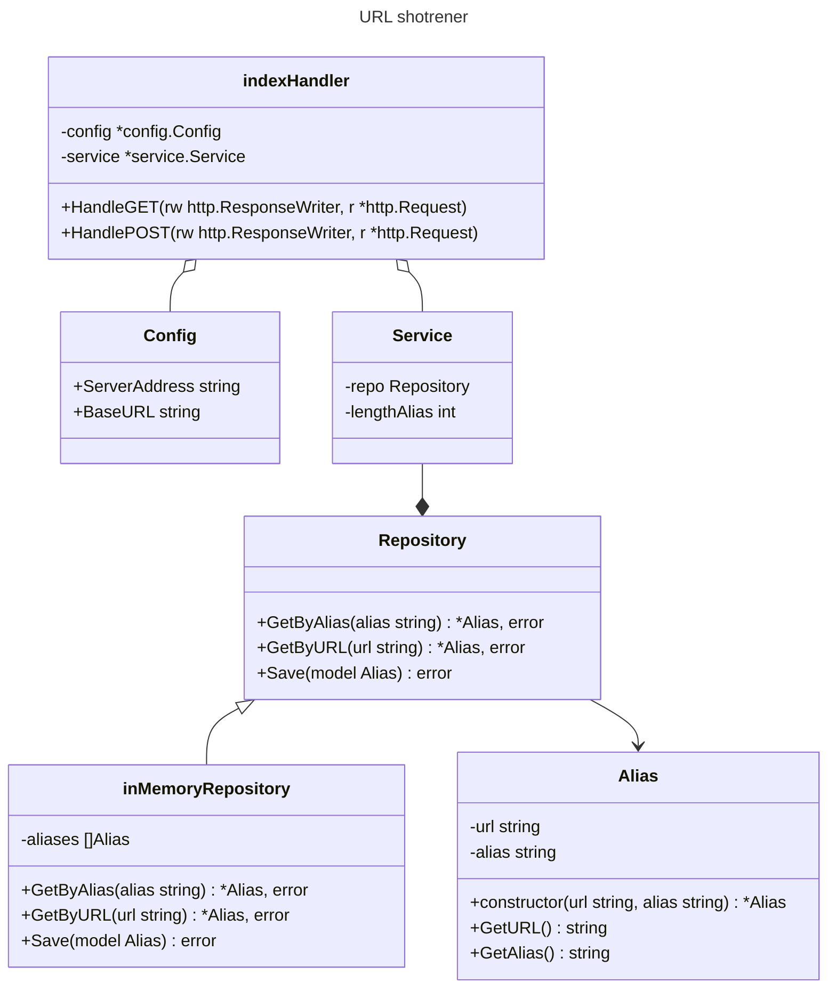

# go-url-shortener

```mermaid
flowchart LR

App --> |Create| Config
App --> |Run| Server
Server --> |Create| IndexHandler
Server --> |Create| chi.NewRoute
 IndexHandler --> |Register| chi.NewRoute
```

```mermaid
---
title: URL shotrener
---
classDiagram

    class Config{
        +ServerAddress string
        +BaseURL string
    }

    class Alias{
        -url string
        -alias string

        +constructor(url string, alias string) *Alias
        +GetURL() string
        +GetAlias() string

    }

    class Repository{
        +GetByAlias(alias string) *Alias, error
        +GetByURL(url string) *Alias, error
        +Save(model Alias) error
    }
    class inMemoryRepository{     
        -aliases []Alias

        +GetByAlias(alias string) *Alias, error
        +GetByURL(url string) *Alias, error
        +Save(model Alias) error
    }
    class Service{
        -repo Repository
        -lengthAlias int
    }

    class indexHandler{
        -config *config.Config
        -service *service.Service

        +HandleGET(rw http.ResponseWriter, r *http.Request)
        +HandlePOST(rw http.ResponseWriter, r *http.Request)
    }

    indexHandler o-- Config
    indexHandler o-- Service
    Service --* Repository
    Repository <|-- inMemoryRepository


    Repository --> Alias
```
